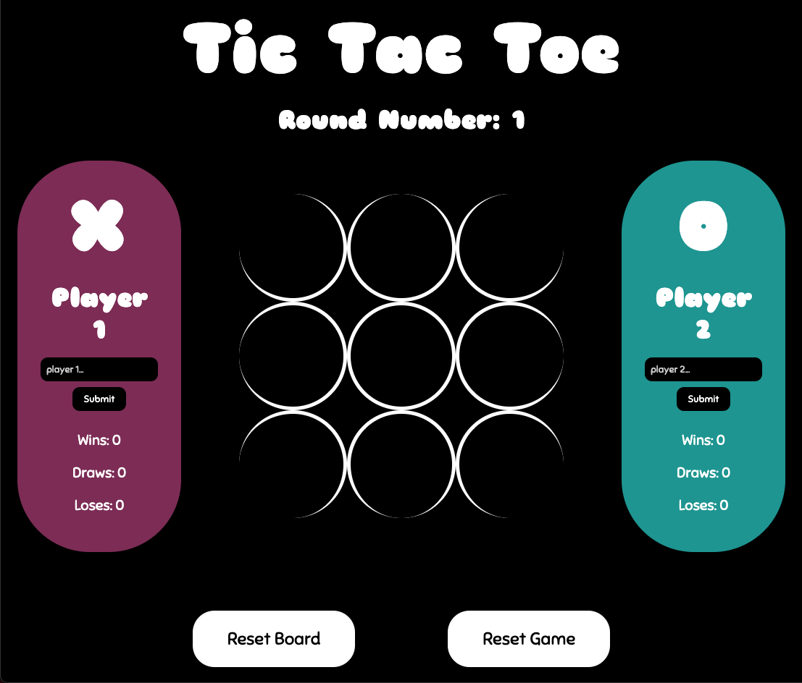

# tic-tac-toe
Welcome to my version of the absolute classic that is Tic Tac Toe (also known as naughts and crosses) with some updated styling, personalised names as well as round & score tracking. So why not grab a friend and come have some fun playing my game of Tic Tac Toe! :raised_hands:

## :computer: [Click here](https://sam26git.github.io/tic-tac-toe/) to see my live project!

## :page_facing_up: About
- How to use my awesome project:
    - Click the link above to navigate to my live tic-tac-toe site! (it should look a little something like the photo below)
    - Start playing, as simple as that!! (I hope you've played tic-tac-toe before :sweat_smile:)

## :pencil2: Planning & Problem Solving
- I started by writing down all the things the game needed to function and turning it into a list of steps to complete (as seen below)
- Then I begun checking off steps and building the backbones (JS) of this project with some very light styling to help visualise along the way.
- Once the game was working how I wanted, it was time to add some additional features and style the project. 
- And voila, done just like that! (not really :sweat_smile:)

## :rocket: Cool tech
- This project uses HTML, CSS & JS 
- Keeps track of round number as well as each players wins, draws & loses
- Use any name for your player (and get a personalised winning message)
- Choose from different button options:
    - Play again after a game finishes
    - Reset the board (we all make mistakes) 
    - Complete reset of board, score, round and names

## :scream: Bugs to fix :poop:
- Improve responsiveness of web design 
    - Only works well at specific dimensions (table can get distorted at small widths or too large at wide widths)

## :sob: Lessons learnt
If I could go back in time to start this project again I would plan ahead for future features and leave space for them later on. I would also come up with a better system for naming my classes and IDs so that they are shorter, more organised and clearer. I would also spend some more time refactoring my code after completing each step so it doesn't stack up and become overwhelming.

## :white_check_mark: Future features
Some cool features I would like to add in the future include:
- Option to play against the computer
- Ability to change themes (dark, light, jungle, custom etc.)
- Add customisation options (time limits, board size, player tokens, avatar/picture etc.)
- Better styling as well as adding animations and transitions
- Using LocalStorage or SessionStorage to persist data locally 
- Add messages throughout the game depending on user interactions
- Add sound effects to different user actions