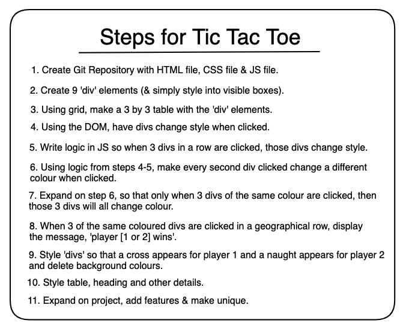

# tic-tac-toe
The briefest description of my cool project and why you should all use it.

## :computer: [Click here](https://sam26git.github.io/tic-tac-toe/) to see my live project!

## :page_facing_up: About
- How to use my awesome project:
    - Click the link above to navigate to my live tic-tac-toe site! (it should look a little something like the photo below :point_down:)
    - Start playing, as simple as that!! (I really hope you've played tic-tac-toe before :sweat_smile:)

## :pencil2: Planning & Problem Solving
- First, I started with a rough plan of the steps I needed to make this project function.
- The next step was to start building the backbones (JS) of this project with some very light styling to help visualise.
- Once it was working how I wanted, it was time to add some additional features and style the project. 
- And voila, done just like that! (it wasn't really that easy :sweat_smile:)

## :rocket: Cool tech
- This project uses HTML, CSS & JS 
- Keeps track of round number as well as each players wins, draws & loses
- Use any name for your player (and get a personalised winning message)
- Choose to play again after a game, reset the board (we all make mistakes) or reset the game to start all over (without refreshing the page) 
- Animations (soon)

## :scream: Bugs to fix :poop:
- Improve responsiveness of web design (works on a standard desktop)
- 

## :sob: Lessons learnt
What I would do differently if I could wind back the clock...

## :white_check_mark: Future features
Some cool features I would like to add in the future include:
- Ability to change themes (dark, light, jungle, custom etc.)
- Option to play against the computer
- Add customisation options (time limits, board size, player tokens, avatar/picture)
- Better styling as well as adding animations and transitions
- Using LocalStorage or SessionStorage
- Add messages throughout the game depending on user interactions
- Add sound effects to the game